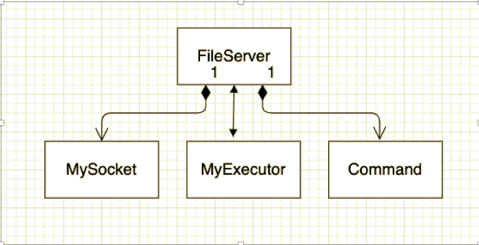
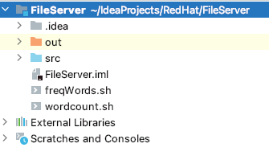

The requirement to create a file store service, has been achieved using java APIs. The architecture diagram of the server , along with various design assumptions have been described in this document.

The code was developed on a Intellij IDE environment.

Server side design

**Execution instructions**

->	First , two shell script files freqWords.sh and wordcount.sh , must be placed in the FileServer folder as shown below, and executable permissions must be assigned to it

-> Run the server from cmd prompt of the folder where FileServer.class is located

**Assumptions made**

->	Server listens only on localhost and port 1988

->	Server is based on a multithreaded executor model

->	Nbr of clients and nbr of files per client are less. This is the basis for choosing a concurrenthashmap to store list of files on the server

->	Files are read in chunks of 1024 bytes

->	Files are stored directly in the folder of FileServer
